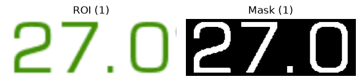
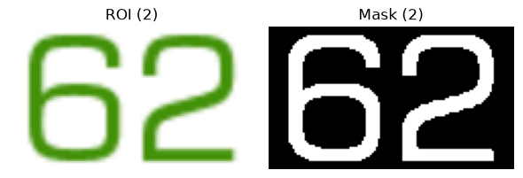
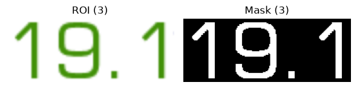
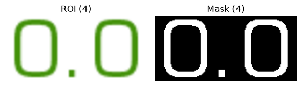
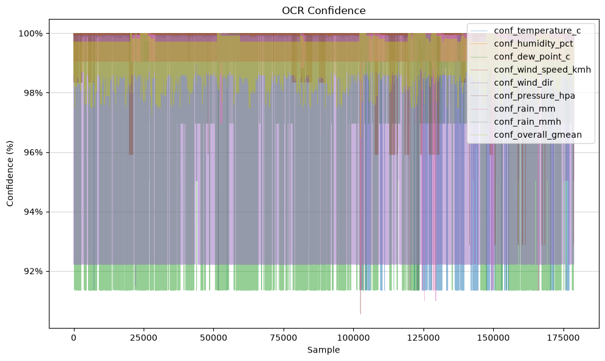

|  |
| - |

# LarioNow

This project is an AI-powered Python application for weather nowcasting in the Lake Como area. It combines data from a network of physical sensor stations, which collect environmental measurements every 5 minutes, with a multi-state machine learning model trained on these observations to generate short-term forecasts (30-60-90–120 minutes ahead). By leveraging high-frequency, real-time sensor data, the system aims to provide accurate hyperlocal predictions of rapidly evolving weather conditions.

> [!NOTE]
> LarioNow is accessible online at the following links:
>
> - **Web Interface:** <a href="https://larionow-app-289545143980.europe-west8.run.app/" target="_blank">https://larionow-app-289545143980.europe-west8.run.app</a>
> - **API:** <a href="https://larionow-api-289545143980.europe-west8.run.app" target="_blank">https://larionow-api-289545143980.europe-west8.run.app</a>

## Prerequisites

> [!IMPORTANT]
>
> - uv
> - Docker

## User Interface (UI)

|  |
| :-: |
| **Home - LarioNow** |

|  |  |
| :-: | :-: |
| **Reference Station** | **Actual Measurements** |

|  |  |
| :-: | :-: |
| **Weather Nowcasting** | **Insights** |

## Instructions

1. Usage:

```sh
bash cmd.sh <command>
```

2. Commands:

```sh
- [▶] start
- [■] stop
- [⚙] build
- [⚙] setup
- [♻] clean <target>
    ├──  --env
    ├──  --docker
    └──  --all
- [⚙] deploy [option] <target>
    ├──  --app
    ├──  --jobs
    └──  --all
```

<br>

> [!WARNING]
> To perform some operations, it could be necessary to authenticate with Google Cloud using your Google account by running sequentially in the terminal the two following commands:
>
> ```sh
> gcloud auth login
> gcloud auth application-default login
> ```

### `setup`

If you are setting up the project for the first time, run the following command to initialize the environment and install the required dependencies:

```sh
bash cmd.sh setup
```

A virtual environment will be created in the `.venv` folder, all the required dependencies will be installed, and a Jupyter kernel will be available for the project.

### `build`

Once the project has been set up, build the application to prepare it for execution:

```sh
bash cmd.sh build
```

Once the build process is complete, the application will be accessible at [http://localhost:8501](http://localhost:8501/), and the related API will be available at [http://localhost:8080](http://localhost:8080/).

### `start`

After building the application, use the following command to start the services:

```sh
bash cmd.sh start
```

### `stop`

When you no longer need the application to be running, stop its services with:

```sh
bash cmd.sh stop
```

### `clean`

To remove resources generated by the project, use the following command and select the desired cleanup option:

```sh
bash cmd.sh clean [--env|--docker|--all]
```

If you need to clean the environment, you can choose the `--env` option, while if you want to clean the Docker resources, you can choose the `--docker` option. If you want to clean all related resources, you can choose the `--all` option.

### `deploy`

After updating the application or its jobs, deploy the required components using:

```sh
bash cmd.sh deploy [--app|--jobs|--all]
```

If you want to deploy the web services, you can choose the `--app` option, while if you want to deploy the jobs, you can choose the `--jobs` option. If you want to deploy all web instances, you can choose the `--all` option.

## Dataset

The dataset consists of environmental measurements collected from a network of physical sensor stations, property of the ***Centro Meteo Lombardo (CML)***, located around Lake Como. The data is collected ***_every 5 minutes_***, starting from August 2026, and includes ***_various weather parameters_*** such as temperature, humidity, dew point, wind speed, wind direction, pressure, and rainfall.

<br>

|  |
| - |
| **Figure 1:** Geographic overview of the provinces surrounding Lake Como (left) and distribution of the available meteorological sensor stations in the area (right). |

### Columns

The dataset contains **32 columns**, organized into four main groups: ***Temporal, Inferential, Meteorological, and Benchmarking*** features.

<br>

> ***Temporal Features***

| **Column** | **Description** |
| - | - |
| `date` | Date and time of the measurement. |
| `year` | Year of the observation. |
| `month` | Month of the observation. |
| `day` | Day of the month. |
| `hour` | Hour of the observation. |
| `minute` | Minute of the observation. |
| `quarter` | Quarter of the year. |
| `week_of_year` | Week number within the year. |
| `day_of_year` | Day number within the year. |
| `day_of_week` | Day of the week. |

<br>

> ***Inferential Features***

| **Column** | **Description** |
| - | - |
| `station` | Identifier of the meteorological sensor station. |
| `city` | City where the station is located. |
| `province` | Province where the station is located. |
| `latitude` | Latitude of the sensor station. |
| `longitude` | Longitude of the sensor station. |

<br>

> ***Meteorological Features***

| **Column** | **Description** |
| - | - |
| `temperature_c` | Air temperature in degrees Celsius. |
| `humidity_pct` | Relative humidity as a percentage. |
| `dew_point_c` | Dew point temperature in degrees Celsius. |
| `wind_speed_kmh` | Wind speed in kilometres per hour. |
| `wind_dir` | Wind direction expressed as a cardinal direction. |
| `pressure_hpa` | Atmospheric pressure in hectopascals. |
| `rain_mm` | Accumulated rainfall in millimetres. |
| `rain_mmh` | Rainfall intensity in millimetres per hour. |

<br>

> ***Benchmarking Features***

| **Column** | **Description** |
| - | - |
| `conf_temperature_c`  | OCR confidence score for the temperature measurement. |
| `conf_humidity_pct` | OCR confidence score for the humidity measurement. |
| `conf_dew_point_c` | OCR confidence score for the dew point measurement. |
| `conf_wind_speed_kmh` | OCR confidence score for the wind speed measurement. |
| `conf_wind_dir` | OCR confidence score for the wind direction measurement. |
| `conf_pressure_hpa` | OCR confidence score for the pressure measurement. |
| `conf_rain_mm` | OCR confidence score for the rainfall measurement. |
| `conf_rain_mmh` | OCR confidence score for the rainfall intensity measurement. |
| `conf_overall_gmean` | Overall geometric mean of the OCR confidence scores. |

### Data Collection

To collect and prepare the data, an ***ETL pipeline*** has been implemented. The pipeline extracts the measurements from the physical sensor stations, transforms them into a structured format, and finally loads them into a ***Google BigQuery*** table for further analysis and modeling.

<br>

> ***Extraction***

The first step consists of collecting the data from the web server of each physical sensor station. The server provides an image containing the current weather measurements, as shown in ***Figure 2***.

<br>

|  |
| - |
| **Figure 2:** Example of the image retrieved from the web server of a physical meteorological sensor station, containing the current weather measurements. |

<br>

> ***Transformation***

The second step converts the image into structured weather measurements. Since the image contains several parameters and additional information, applying OCR directly to the full image could introduce unnecessary noise. For this reason, the image is first processed to isolate the relevant areas before applying the ***OCR (Optical Character Recognition) model***.

The first step is to separate the green and blue text into two different channels. This makes the weather measurements easier to identify and removes part of the information that is not needed for the extraction.

<br>

|  |
| - |
| **Figure 3:** Color-channel segmentation of the weather station image. The original image is shown on the left, while the segmented green and blue text channels are shown in the center and on the right, respectively. |

<br>

After the color segmentation, the image is divided into separate ***Regions of Interest (ROIs)***, one for each weather parameter. In this way, the OCR model receives only the part of the image containing the measurement that needs to be extracted.

To find these regions, the segmented image is first slightly enlarged using a morphological dilation operation. This connects nearby pixels belonging to the same text and makes each field easier to identify. The resulting areas are then detected using the ***OpenCV*** contour detection algorithm.

For each detected area, a bounding box is created and used to extract the corresponding ROI. Very small areas are discarded, while a small padding is added around each box to avoid cutting characters near the borders.

<br>

|  |
| - |
| **Figure 4:** Example of the ROI extraction process after color segmentation, showing the identified measurement fields before they are merged into the final input regions. |

The extracted regions are then passed to the OCR model, which returns the corresponding weather measurements together with a confidence score. The final result of the transformation step is therefore a structured dataset containing the extracted parameters and their confidence scores, as shown in ***Figure 5***.

<br>

|  |
| - |
| **Figure 5:** Input regions provided to the OCR model, showing the extracted weather parameters together with their corresponding OCR confidence scores. |

<br>

To provide a more general overview of the OCR model's performance, ***Figure 6*** shows the confidence scores obtained for each extracted parameter across all the samples collected in the dataset.

<br>

|  |
| - |
| **Figure 6:** Distribution of OCR confidence scores for each extracted weather parameter across all samples collected in the dataset. |

<br>

> ***Loading***

The final step consists of loading the structured data into a ***Google BigQuery*** table. The resulting table can then be used for the following analysis and modeling steps.

## Results

...

## Credits

> [!WARNING]
>
> Please use this project responsibly, it was created by me for an exam session that I completed at _University of Insubria_. If you use or reference this project, please cite it as follows:
>
> ```bib
> @misc{vicario2026larionow,
>     author = {R. Vicario},
>     title  = {LarioNow},
>     year   = {2026},
>     url    = {https://github.com/robertovicario/LarioNow}
> }
> ```

## License

This project is distributed under [GNU General Public License version 3](https://opensource.org/license/gpl-3-0). You can find the complete text of the license in the project repository.
