|  |
| - |

# LarioNow

This project is an AI-powered Python application for weather nowcasting in the Lake Como area. It combines data from a network of physical sensor stations, which collect environmental measurements every 5 minutes, with a multi-state machine learning model trained on these observations to generate short-term forecasts (30-60-90–120 minutes ahead). By leveraging high-frequency, real-time sensor data, the system aims to provide accurate hyperlocal predictions of rapidly evolving weather conditions.

> [!NOTE]
> LarioNow is accessible online at the following link: [https://larionow-289545143980.europe-west8.run.app](https://larionow-289545143980.europe-west8.run.app)

## Prerequisites

> [!IMPORTANT]
>
> - uv
> - Docker

## User Interface (UI)

| 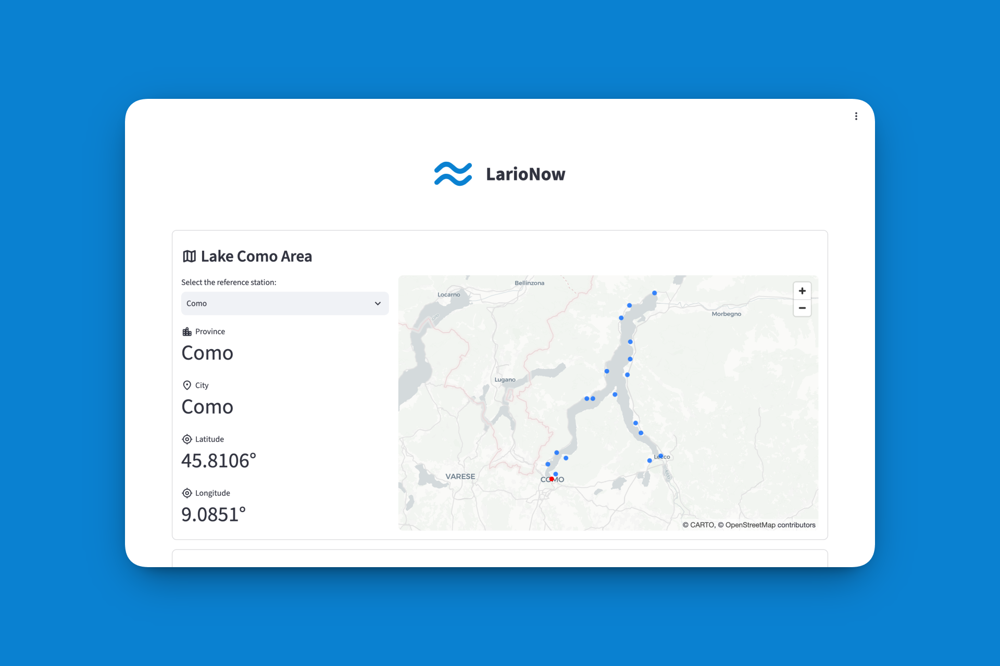 |
| :-: |
| **Home - LarioNow** |

| 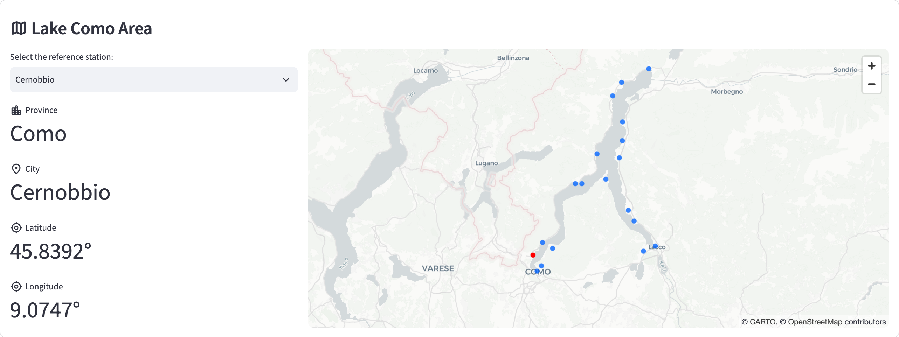 | 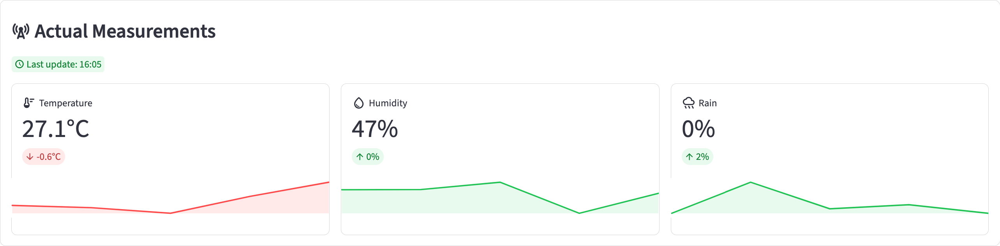 |
| :-: | :-: |
| **Reference Station** | **Actual Measurements** |

| 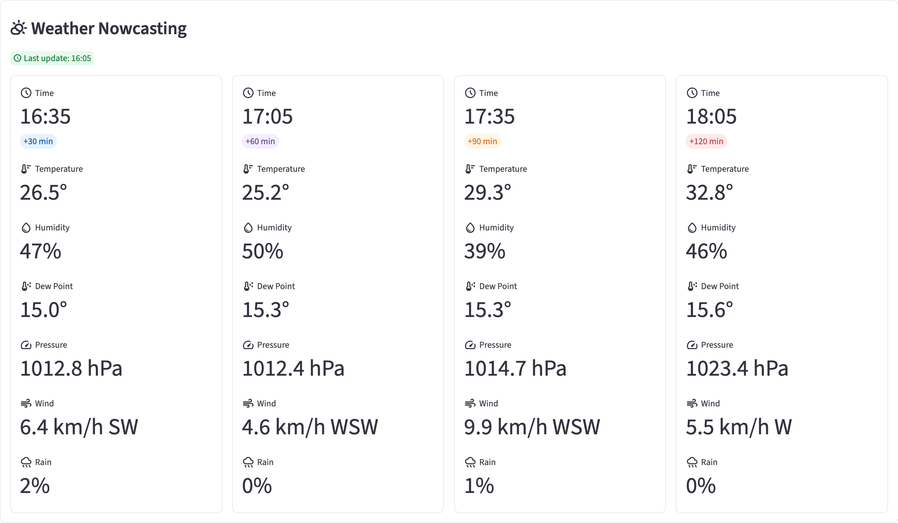 | 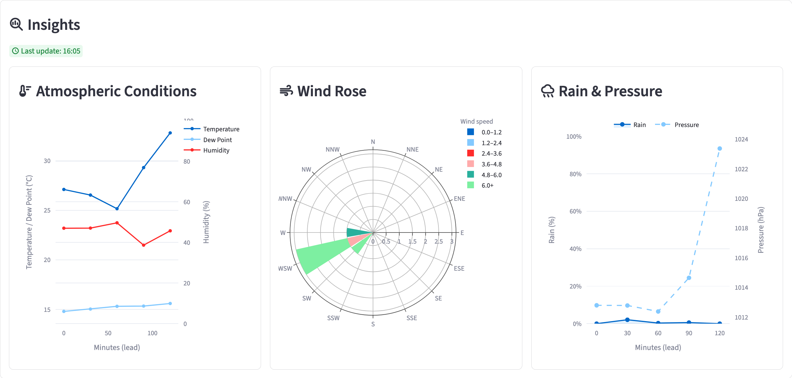 |
| :-: | :-: |
| **Weather Nowcasting** | **Insights** |

## Instructions

Usage:

```sh
bash cmd.sh {start|stop|build|clean|setup|collector|retraining|deploy}
```

### `setup`

If you haven't set up the project yet, you can do so by running the following command:

```sh
bash cmd.sh setup
```

A virtual environment will be created in the `.venv` folder, all the required dependencies will be installed, and a Jupyter kernel will be available for the project.

> [!WARNING]
> To perform some operations, it could be necessary to authenticate with Google Cloud using your Google account by running sequentially in the terminal the two following commands:

```sh
gcloud auth login
```

```sh
gcloud auth application-default login
```

### `build`

To make the application up and running, first you need to build the application by running the following command:

```sh
bash cmd.sh build
```

Once the build process is complete, the project will be accessible at [http://localhost:8501](http://localhost:8501).

### `start`

The Docker containers can be started by running the following command:

```sh
bash cmd.sh start
```

### `stop`

Otherwise, if you want to stop the application containers, you can run the following command:

```sh
bash cmd.sh stop
```

### `clean`

By running the following command, you can clean the project:

```sh
bash cmd.sh clean [--env|--docker]
```

If you need to clean the virtual environment, you can choose the `--env` option, while if you want to clean the Docker images, you can choose the `--docker` option.

### `collector`

To collect new data, you can run the following command:

```sh
bash cmd.sh collector
```

It exists a Google Cloud Run job scheduled to run every 5 minutes (`*/5 * * * *`).

### `retraining`

To retrain the model, the following command can be used:

```sh
bash cmd.sh retraining
```

There is a Google Cloud Run job scheduled to run every 2 hours (`0 */2 * * *`) to retrain the model with the latest data.

### `deploy`

The services and the jobs could be deployed by running the following command after every update:

```sh
bash cmd.sh deploy [--app|--jobs]
```

If you want to deploy the application, you can choose the `--app` option, while if you want to deploy the jobs, you can choose the `--jobs` option.

## Dataset

The dataset consists of environmental measurements collected from a network of physical sensor stations, property of the ***Centro Meteo Lombardo (CML)***, located around Lake Como. The data is collected *******_every 5 minutes_*******, starting from August 2026, and includes *******_various weather parameters_******* such as temperature, humidity, dew point, wind speed, wind direction, pressure, and rainfall.

| 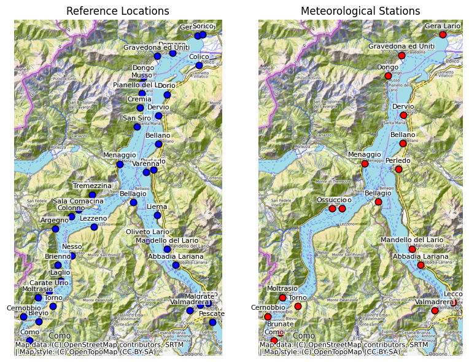                                                                             |
| ------------------------------------------------------------------------------------------------------------------------------------ |
| ****Figure 1:**** A representation of the lakeside provinces (left) and the available meteorological stations near the lake (right). |

<br>

### ETL Pipeline

To collect and prepare the data, an ***ETL pipeline*** has been implemented. The pipeline extracts the measurements from the physical sensor stations, transforms them into a structured format, and finally loads them into a ***Google BigQuery*** table for further analysis and modeling.

<br>

> ***Extraction***

The first step consists of collecting the data from the web server of each physical sensor station. The server provides an image containing the current weather measurements, as shown in ***Figure 2***.

|                                            |
| -------------------------------------------------------------------------------------------------- |
| ****Figure 2:**** An example of the image returned by the web server of a physical sensor station. |

<br>

> ***Transformation***

The second step converts the image into structured weather measurements. Since the image contains several parameters and additional information, applying OCR directly to the full image could introduce unnecessary noise. For this reason, the image is first processed to isolate the relevant areas before applying the ***OCR (Optical Character Recognition) model***.

The first step is to separate the green and blue text into two different channels. This makes the weather measurements easier to identify and removes part of the information that is not needed for the extraction.

|  |
| ------------------------------------------------------------------------------------------------------------------------------------------------------------------------ |
| ****Figure 3:**** The original image is shown on the left, while the segmented green and blue channels are shown in the center and on the right, respectively.           |

<br>

After the color segmentation, the image is divided into separate ***Regions of Interest (ROIs)***, one for each weather parameter. In this way, the OCR model receives only the part of the image containing the measurement that needs to be extracted.

To find these regions, the segmented image is first slightly enlarged using a morphological dilation operation. This connects nearby pixels belonging to the same text and makes each field easier to identify. The resulting areas are then detected using the ***OpenCV*** contour detection algorithm.

For each detected area, a bounding box is created and used to extract the corresponding ROI. Very small areas are discarded, while a small padding is added around each box to avoid cutting characters near the borders.

The complete process is summarized in ***Algorithm 1***.

|                                                         |
| --------------------------------------------------------------------------------------------------------------- |
| ****Algorithm 1:**** The process used to identify and extract the Regions of Interest from the segmented image. |

| 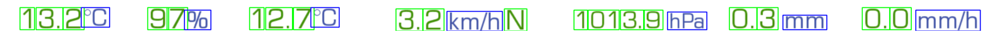                                 |
| ---------------------------------------------------------------------------------------- |
| ****Figure 4:**** A practical application of the segmentation before merging the fields. |

The extracted regions are then passed to the OCR model, which returns the corresponding weather measurements together with a confidence score. The final result of the transformation step is therefore a structured dataset containing the extracted parameters and their confidence scores, as shown in ***Figure 5***.

| 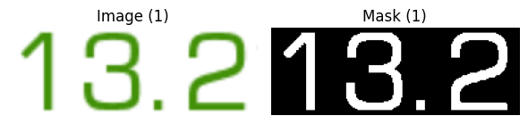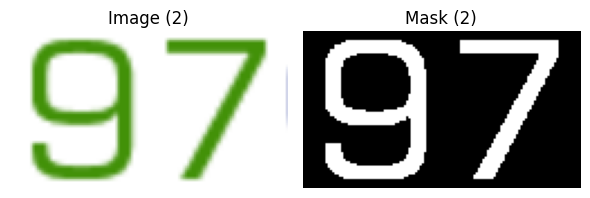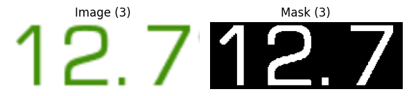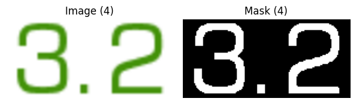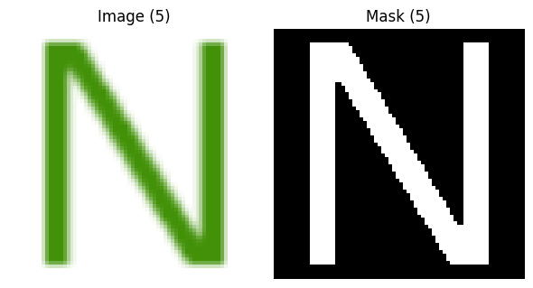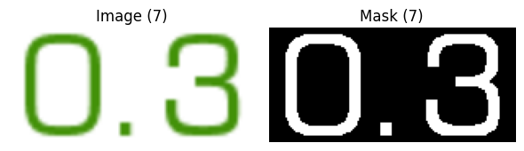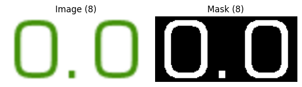 |
| ------------------------------------------------------------------------------------------------------------------------------------------------------------------------------------------------------------------------------------------------------------------------------------------------------------------------------------------------------------------------------------------------------------------------------------------------------------------------ |
| ****Figure 5:**** The final input to the OCR model, consisting of the extracted weather parameters and their corresponding confidence scores.                                                                                                                                                                                                                                                                                                                            |

<br>

To give a more practical example of the OCR performance, the confidence scores obtained for the measurements shown in the figures above are reported below:

```sh
2026-08-22 10:39:23.814 | DEBUG    | lib.utils:ocr_predict:166 -  temperature_c:   13.2 (confidence=1.000)
2026-08-22 10:39:23.883 | DEBUG    | lib.utils:ocr_predict:166 -   humidity_pct:     97 (confidence=1.000)
2026-08-22 10:39:23.954 | DEBUG    | lib.utils:ocr_predict:166 -    dew_point_c:   12.7 (confidence=0.981)
2026-08-22 10:39:24.024 | DEBUG    | lib.utils:ocr_predict:166 - wind_speed_kmh:    3.2 (confidence=0.999)
2026-08-22 10:39:24.096 | DEBUG    | lib.utils:ocr_predict:166 -       wind_dir:      N (confidence=0.994)
2026-08-22 10:39:24.180 | DEBUG    | lib.utils:ocr_predict:166 -   pressure_hpa: 1013.9 (confidence=1.000)
2026-08-22 10:39:24.251 | DEBUG    | lib.utils:ocr_predict:166 -        rain_mm:    0.3 (confidence=0.999)
2026-08-22 10:39:24.322 | DEBUG    | lib.utils:ocr_predict:166 -       rain_mmh:    0.0 (confidence=0.991)
```

<br>

To provide a more general overview of the OCR model's performance, ***Figure 6*** shows the confidence scores obtained for each extracted parameter across all the samples collected in the dataset.

| 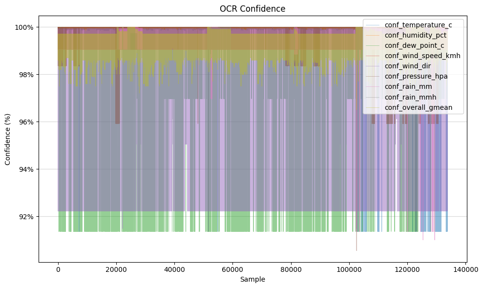                                                        |
| ----------------------------------------------------------------------------------------------------------------- |
| ****Figure 6:**** Confidence scores for each extracted parameter across all the samples collected in the dataset. |

<br>

> ***Loading***

The final step consists of loading the structured data into a ***Google BigQuery*** table. The resulting table can then be used for the following analysis and modeling steps.

Below are the technical instructions to replicate the ETL pipeline and the data collection process.

### `collector`

To collect new data, the following command can be executed:

```sh
bash cmd.sh collector
```

A Google Cloud Run job is scheduled to run this command every 5 minutes (`*/5 * * * *`), allowing the dataset to be continuously updated with new measurements.

## Results

...

### `retraining`

To retrain the model, the following command can be used:

```sh
bash cmd.sh retraining
```

## Credits

> [!WARNING]
>
> Please use this project responsibly, it was created by me for an exam session that I completed at _University of Insubria_. If you use or reference this project, please cite it as follows:
>
> ```bib
> @misc{vicario2026datascience,
>     author = {R. Vicario},
>     title  = {uninsubria-DATA_SCIENCE},
>     year   = {2026},
>     url    = {https://github.com/robertovicario/uninsubria-DATA_SCIENCE}
> }
> ```

## License

This project is distributed under [GNU General Public License version 3](https://opensource.org/license/gpl-3-0). You can find the complete text of the license in the project repository.
